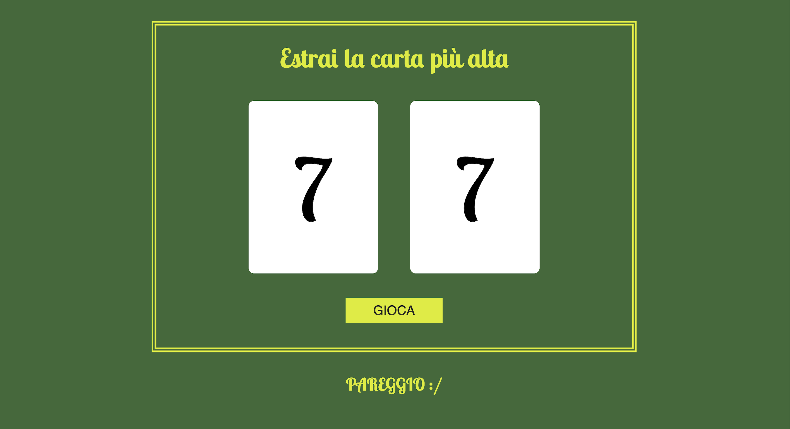

# La carta più alta

Piccola applicazione web che simula una sfida tra il giocatore e il computer, in cui vengono estratti due valori casuali e vince chi ottiene la carta più alta.

## Funzionalità
- estrazione casuale di due carte
- confronto automatico dei valori
- visualizzazione immediata del risultato
- messaggio finale di vittoria, sconfitta o pareggio

## Tecnologie usate
- HTML
- JavaScript
- CSS

## Come usare il progetto
1. Clona o scarica il repository
2. Apri `index.html` nel browser
3. Premi il pulsante **Gioca**
4. Controlla il risultato della partita

## Struttura del progetto
- `index.html` → struttura della pagina
- `index.js` → logica del gioco
- `stile.css` → stile dell’interfaccia

## Note
Il progetto usa JavaScript per generare in modo casuale due numeri da 1 a 10, assegnarli al giocatore e al computer e mostrare nella pagina il risultato finale della partita.

## Demo

